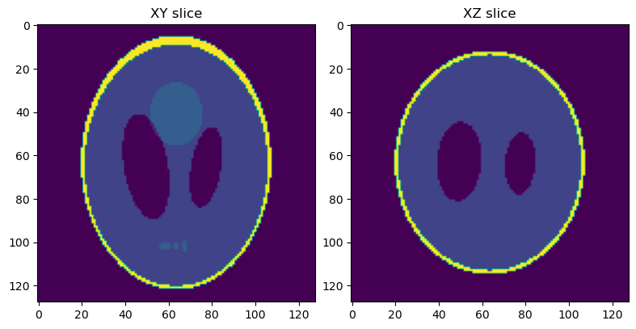
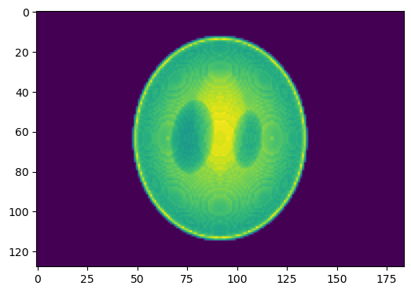
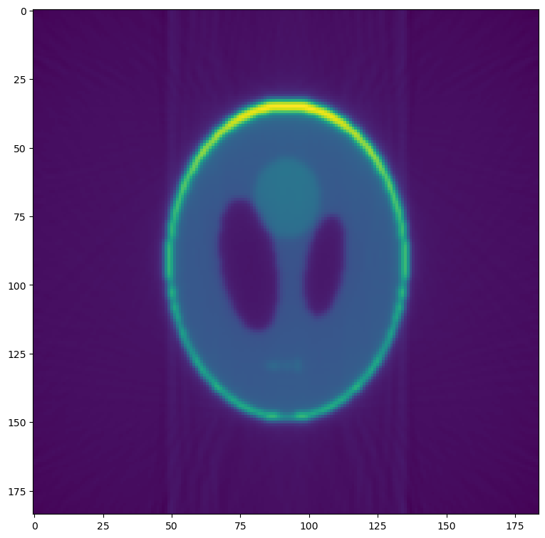
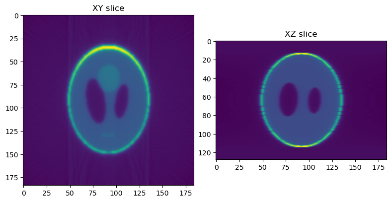
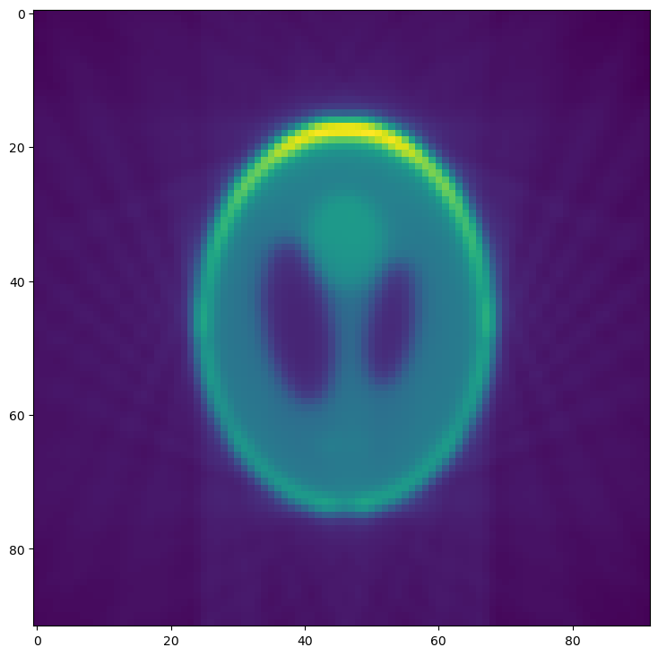

=================================
Tutorial 1: Basic Reconstructions
=================================

This tutorial will guide you through the first simple tomography
reconstruction. By the end, you will be able to:

- Load a set of projection images
- Produce a single reconstructed slice
- Produce the full reconstructed volume
- Supply command line arguments to alter the reconstruction behavior
- Create a configuration file to stream-line reconstructions

.. note::

   This tutorial assumes you have a working python installation
   (i.e. Anaconda) and have :ref:`installed tomopy-cli<Installation
   from Source>` and it's :ref:`dependencies<Dependencies>` (both
   tomopy and dxchange).

.. warning::

   This tutorial has only been tested on **GNU/Linux** operating
   systems. Windows and MacOS support is an ongoing project.

Preamble: Prepare Test Images
=============================

.. note::

   This tutorial will use some test data known as the *Shepp-Logan
   phantom*, which will need to be saved in a format that mimics
   synchrotron tomography data. This preamble section is not needed
   when performing reconstructions on real experimental data.

First, open a terminal and create an empty directory to hold our data:

.. code-block:: bash

   $ mkdir tomopy_cli_tutorial
   $ cd tomopy_cli_tutorial

We will also need a way to view the results of our reconstruction, so
we'll install matplotlib:

.. code-block:: bash

   $ pip install matplotlib

Now **open a python console** (``$ python``) and use the tomopy
package to prepare phantom test data:

.. code-block:: python

   >>> import tomopy, dxchange, numpy, h5py, matplotlib.pyplot as plt
   >>> phantom = tomopy.misc.phantom.shepp3d(128)

And visualize the results:

.. code-block:: python

   >>> fig, (axL, axR) = plt.subplots(1, 2)
   >>> axL.imshow(phantom[64])
   >>> axL.set_title("XY slice")
   >>> axR.imshow(phantom[:,64])
   >>> axR.set_title("XZ slice")
   >>> plt.show(block=False)

You should now see a plot with a horizontal (XY) slice and a vertical
(XZ) slice of the test data:

Next, we will simulate a set of projection images from this phantom
volume.

.. code-block:: python

   >>> angles = tomopy.sim.project.angles(181)
   >>> proj = tomopy.sim.project.project(phantom, theta=angles)
   >>> plt.figure()
   >>> plt.imshow(proj[0])
   >>> plt.show(block=False)

You should now see the first image in a series of simulated
projections of the phantom volume.
   

This set of projections will be used as input for reconstructions in
the rest of this tutorial, so we will save them and then leave the
python console for the next segment of this tutorial:

.. warning::

   This following commands will overwrite any existing file named
   *phantom_projections.h5*.

.. code-block::
   
   >>> file = h5py.File("phantom_projections.h5", mode="w")
   >>> file.create_dataset("exchange/data", data=numpy.exp(-proj))
   >>> file.create_dataset("exchange/data_white", data=numpy.ones(shape=(1, *proj.shape[-2:])))
   >>> file.create_dataset("exchange/data_dark", data=numpy.zeros(shape=(1, *proj.shape[-2:])))
   >>> file.close()
   >>> exit()

Perform a Single Slice Reconstruction
=====================================

Now that we have some projection data work with, we will perform a
simple single-slice reconstruction:

.. code-block::

   $ tomopy recon --file-name phantom_projections.h5 --reconstruction-type=slice --output-folder=_rec

This will save reconstructions as TIFF files in the *_rec*
folder. Single slice reconstructions are stored in
*_rec/slice_rec*.

To visualize the results, **open a python console** again and use
matplotlib to view the reconstructed data.

.. code-block:: python

   >>> import matplotlib.pyplot as plt, imageio
   >>> slc = imageio.read("_rec/slice_rec/recon_phantom_projections.tiff").get_data(0)
   >>> plt.figure()
   >>> plt.imshow(slc)
   >>> plt.show(block=False)

Compare this reconstructed slice to the original phantom produced in
the first section.

Perform a Full Volume Reconstruction
====================================

We will now use *tomopy-cli* to reconstruct the full volume. This is
done by changing the ``--reconstruction-type`` option:

.. code-block:: bash

   $ tomopy recon --file-name phantom_projections.h5 --reconstruction-type=full --output-folder=_rec --output-format=tiff_stack

Reconstructions are again stored in *_rec*, but full volume
reconstructions can be found in *_rec/phantom_projections_rec*. Again,
**open a python console** to visualize the results:

.. code-block:: python

   >>> import matplotlib.pyplot as plt, dxchange
   >>> recon = dxchange.read_tiff_stack("_rec/phantom_projections_rec/recon_00000.tiff", ind=range(0, 128))
   >>> fig, (axL, axR) = plt.subplots(1, 2)
   >>> axL.imshow(recon[64])
   >>> axL.set_title("XY slice")
   >>> axR.imshow(recon[:,92])
   >>> axR.set_title("XZ slice")
   >>> plt.show(block=False)

Modify Reconstruction Behavior
==============================

Now we will use some of tomopy-cli's command line options to modify
the reconstruction behavior. We will add four features to our
reconstruction:

1. Downsample (bin) the data by a factor of 2
2. Manually specify the rotation center
3. Remove any NaN or infinity values

.. code-block:: bash

    $ tomopy recon --file-name phantom_projections.h5 --reconstruction-type=slice --output-folder=_rec --binning=1 --rotation-axis-auto=manual --rotation-axis=91.5 --fix-nan-and-inf --fix-nan-and-inf-value=34.05

Now we will visualize the new reconstruction. **Open a python
console** again and use matplotlib to view the reconstructed data.

.. note::

   If you ran the previous slice reconstruction command more than
   once, you may have to modify the file name in the example below,
   since each time tomopy is run, a new tiff file is saved.

   In this case, if the previous command was run twice, this would
   create files *recon_phantom_projections.tiff* and
   *recon_phantom_projections-1.tiff*, so we would now need to replace
   the file name with *recon_phantom_projections-2.tiff*

.. code-block:: python

   >>> import matplotlib.pyplot as plt, imageio
   >>> slc = imageio.read("_rec/slice_rec/recon_phantom_projections-1.tiff").get_data(0)
   >>> plt.figure()
   >>> plt.imshow(slc)
   >>> plt.show(block=False)

Comparing this reconstruction with the previous versions, the major
difference is the lower resolution and noise resulting from the
``--binning=1`` option. Since we are using well-behaved test data, the
other options have no noticeable effect.

Details for these options and many more can be seen by running
``tomopy recon --help`` from the command line.

